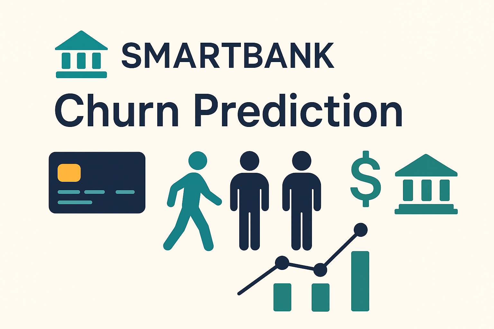

# 🏦 Lloyds Banking Group – Customer Retention Predictive Analytics Project

Welcome to my submission for the **Lloyds Banking Group: Data Science & Analytics Virtual Internship**, hosted on [Forage](https://www.theforage.com/simulations/lloyds-banking-group/data-science-fpey). This project simulates a real-world assignment within Lloyds' Data Science team, focused on solving a critical customer retention problem using predictive analytics.

---

## 📌 Project Brief

As a new data science graduate on the **Data Science & Analytics** team, I’ve been tasked with a high-impact project:  
**Customer Retention Enhancement through Predictive Analytics**.

SmartBank — a subsidiary of Lloyds — is experiencing rising churn, especially among **young professionals** and **small business owners**. Our goal is to build a solution that:
- Identifies customers likely to churn
- Helps the business intervene with tailored retention strategies

---

## 🧠 Key Concepts

- **Customer churn:** When customers stop using a company's services — a direct hit to profitability.
- **Predictive analytics:** Using historical data to forecast future events (e.g., churn).
- **Exploratory Data Analysis (EDA):** Uncovering insights, trends, and feature patterns in data.
- **Machine learning (classification):** Building models that predict churn probability based on customer data.

---

## 🛠️ Project Phases & Deliverables

### 📊 Phase 1: Data Exploration & Preparation

> **Objective:** Understand the data and prepare it for modelling.

**Tasks:**
- Gather and explore relevant datasets
- Conduct EDA to uncover patterns
- Clean and preprocess the data

**✅ Deliverable:**  
- An EDA report
- Cleaned and structured dataset ready for modelling

---

### 🤖 Phase 2: Predictive Modelling

> **Objective:** Build a machine learning model to predict customer churn.

**Tasks:**
- Select and train a classification model
- Evaluate performance using appropriate metrics
- Propose methods for measuring effectiveness in real-world deployment

**🔜 Deliverable:**  
- Trained machine learning model
- Evaluation summary and performance metrics
- Insights on model reliability and business application

---

## 💡 Why This Project Matters

SmartBank is facing pressure from competitors offering more personalized services. If unchecked, churn threatens both profitability and market share.  
This project plays a vital role in helping:
- Stabilize customer retention
- Improve service personalization
- Support long-term sustainability at Lloyds

---

## ✍️ Reflections

> This project pushed me to improve my workflow by developing **custom, reusable functions** for tasks like model evaluation and reporting — making my process more efficient and scalable. It also sharpened my **attention to detail**, especially in how I approached data cleaning and insight generation. Most importantly, it taught me to ask **deeper, more strategic questions** — not just *“What is the model telling me?”* but also *“How does this insight support SmartBank’s retention goals?”*

---

Crafted with insight and impact by **Kofoworola Egbinola**  
